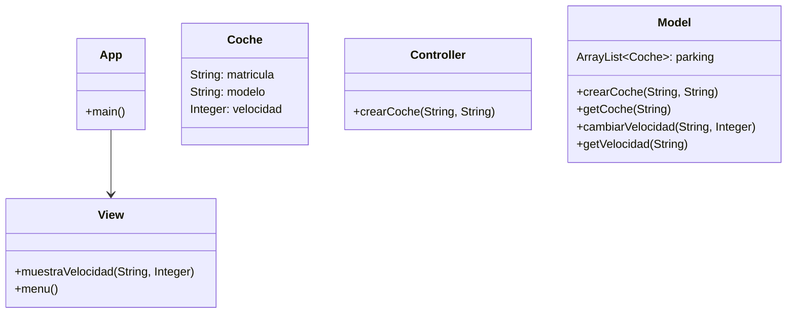
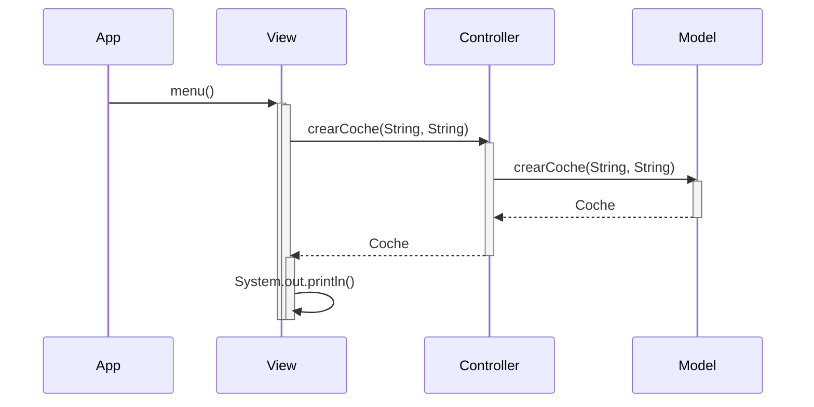

# Arquitectura MVC

Aplicación que trabaja con objetos coches, modifica la velocidad y la muestra

---
## Diagrama de clases:

---

## Diagrama de Secuencia

Ejemplo básico del procedimiento

Gestión de Coches (Java MVC)

Aplicación Java para gestionar una lista de coches, desarrollada utilizando el patrón de arquitectura **MVC** y un flujo de trabajo profesional con **GitHub**: creación de issues, ramas, commits, y pull requests.

---

##  Funcionalidades

-  Crear coche
-  Aumentar velocidad
-  Disminuir velocidad
-  Mostrar todos los coches

---

##  Arquitectura MVC

- **Modelo** → `model/Coche.java`
- **Vista** → `view/CocheView.java`
- **Controlador** → `controller/CocheController.java`
- **Main** → `Main.java` (interfaz por consola)

---

##  Estructura del proyecto

src/
├── controller/
│ └── CocheController.java
├── model/
│ └── Coche.java
├── view/
│ └── CocheView.java
├── Main.java

---

 Flujo de trabajo con GitHub
A continuación vopy a describ paso a paso el desarrollo, usando buenas prácticas de Git:

1.  Crear un Issue
Cree un issue para registrar la tarea principal:

Título: Añadir funcionalidades básicas para gestión de coches (MVC)
Contenido: Descripción de los requisitos y objetivos del proyecto.

2.  Crear rama de desarrollo
Cree una rama para trabajar de forma aislada del código principal:

git checkout -b feature/gestion-coches
Esta rama contiene toda la lógica y arquitectura MVC.

3.  Implementación paso a paso
Se implementaron las clases Coche, CocheController, CocheView y Main.

Se respetó la separación de responsabilidades (MVC).

Se documentaron las clases con JavaDoc.

Se probaron las funcionalidades desde consola.

4.  Commits realizados
Durante el desarrollo hice múltiples commits con mensajes descriptivos, por ejemplo:

git commit -m " Añadir clase modelo Coche con métodos acelerar y frenar"
git commit -m " Crear controlador para gestionar coches"
git commit -m "🖥 Vista por consola para mostrar coches"
git commit -m " Añadir clase Main con menú interactivo"
5. ⬆ Subida a GitHub
Una vez terminado el desarrollo:

git push origin feature/gestion-coches

6.  Pull Request
Desde GitHub:

Cree un Pull Request desde feature/gestion-coches hacia main.

Revisé y aprobó el PR.

Hice merge a main.

