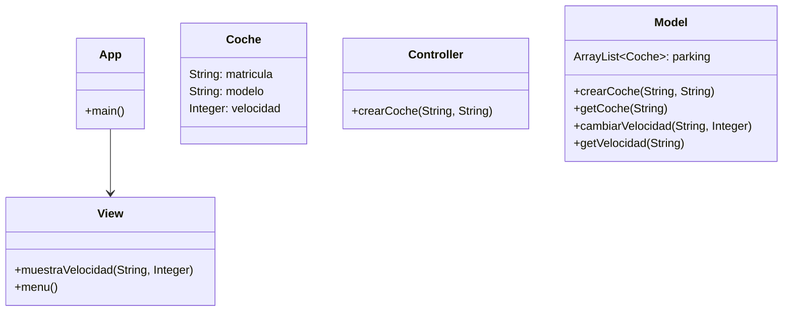
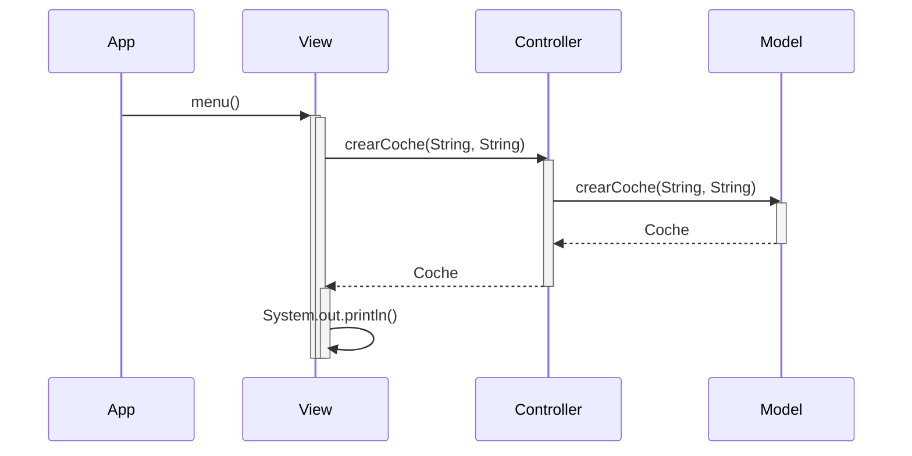
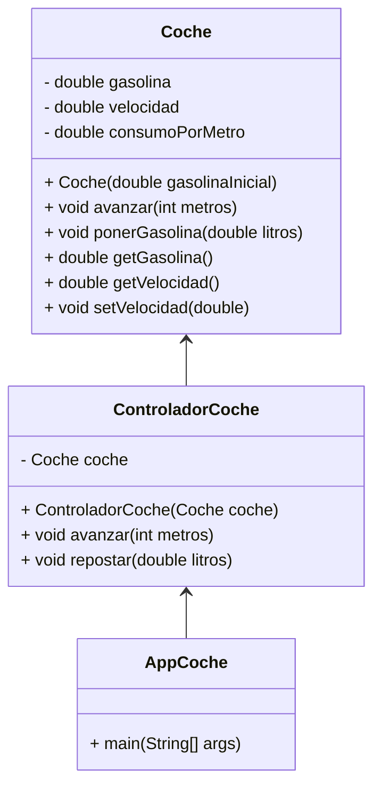

# Arquitectura MVC

Aplicación que trabaja con objetos coches, modifica la velocidad y la muestra

---
## Diagrama de clases:



---

## Diagrama de Secuencia

Ejemplo básico del procedimiento



Gestión de Coches (Java MVC)

Aplicación Java para gestionar una lista de coches, desarrollada utilizando el patrón de arquitectura **MVC** y un flujo de trabajo profesional con **GitHub**: creación de issues, ramas, commits, y pull requests.

---

##  Funcionalidades

-  Crear coche
-  Aumentar velocidad
-  Disminuir velocidad
-  Mostrar todos los coches

---

##  Arquitectura MVC

- **Modelo** → `model/Coche.java`
- **Vista** → `view/CocheView.java`
- **Controlador** → `controller/CocheController.java`
- **Main** → `Main.java` (interfaz por consola)

---

##  Estructura del proyecto


src/
├── controller/
│ └── CocheController.java
├── model/
│ └── Coche.java
├── view/
│ └── CocheView.java
├── Main.java


---


Flujo de trabajo con GitHub
A continuación vopy a describ paso a paso el desarrollo, usando buenas prácticas de Git:

1.  Crear un Issue
    Cree un issue para registrar la tarea principal:

Título: Añadir funcionalidades básicas para gestión de coches (MVC)
Contenido: Descripción de los requisitos y objetivos del proyecto.

2.  Crear rama de desarrollo
    Cree una rama para trabajar de forma aislada del código principal:

git checkout -b feature/gestion-coches
Esta rama contiene toda la lógica y arquitectura MVC.

3.  Implementación paso a paso
    Se implementaron las clases Coche, CocheController, CocheView y Main.

Se respetó la separación de responsabilidades (MVC).

Se documentaron las clases con JavaDoc.

Se probaron las funcionalidades desde consola.

4.  Commits realizados
    Durante el desarrollo hice múltiples commits con mensajes descriptivos, por ejemplo:

git commit -m " Añadir clase modelo Coche con métodos acelerar y frenar"
git commit -m " Crear controlador para gestionar coches"
git commit -m " Vista por consola para mostrar coches"
git commit -m " Añadir clase Main con menú interactivo"
5.  Subida a GitHub
    Una vez terminado el desarrollo:

git push origin feature/gestion-coches

6.  Pull Request
    Desde GitHub:

Cree un Pull Request desde feature/gestion-coches hacia main.

Revisé y aprobó el PR.

Hice merge a main.


# Empieza examen

## AppCoche MVC - Implementación de nuevas funcionalidades

##  Enunciado

Utiliza la app de coche con MVC para implementar lo siguiente:

- **Nuevas opciones:**
    - Avanzar (metros)
    - Poner gasolina (litros)

- **Lógica:**
    - Cada vez que se avanza, disminuye la gasolina en función de la **distancia** y la **velocidad**.

- Se requiere:
    - Diagrama de secuencia en papel
    - Pseudocódigo en papel
    - Código implementado
    - Repositorio sin issues ni test unitarios

---

##  Enfoque adoptado

###  Diseño según MVC

- **Model (`Coche`)**
    - Contiene atributos como `gasolina`, `velocidad`, y métodos como `avanzar(metros)` y `ponerGasolina(litros)`.
    - Implementa la lógica de consumo de gasolina en función de la distancia.

- **Controller (`ControllerCoche`)**
    - Intermediario entre la vista y el modelo.
    - Llama a los métodos del modelo según la interacción del usuario.

- **View (`App`)**
    - Muestra un menú en consola para interactuar con el usuario.
    - Solicita entradas, las pasa al controlador, y muestra resultados.

---

##  Nuevas funcionalidades

###  Avanzar (metros)

- El usuario introduce los metros que desea avanzar.
- Se calcula el consumo de gasolina como:
  consumo = metros * consumoPorMetro

- La velocidad puede influir si se amplía la lógica (no obligatorio en esta versión).
- Se actualiza el nivel de gasolina.

###  Poner gasolina (litros)

- El usuario introduce los litros a repostar.
- Se actualiza el estado del depósito.
- Se impide superar la capacidad máxima.

---

##  Justificación

- Se mantiene el **principio de separación de responsabilidades** de MVC.
- La lógica de negocio está únicamente en el **modelo** (`Coche.java`).
- La **vista** sólo se ocupa de mostrar opciones y recoger datos.
- El **controlador** actúa como puente, manteniendo el código desacoplado.


##  Diagrama de clases (MVC + funcionalidades)



## Diagrama de secuencia Avanzar

```sequenceDiagram
participant Usuario
participant AppCoche
participant ControladorCoche
participant Coche

    Usuario->>AppCoche: Elige "Avanzar"
    AppCoche->>ControladorCoche: avanzar(metros)
    ControladorCoche->>Coche: avanzar(metros)
    Coche-->>ControladorCoche: gasolina actualizada
    ControladorCoche-->>AppCoche: operación completada
```

## Diagrama de secuencia ponerGasolina

```
sequenceDiagram
participant Usuario
participant AppCoche
participant ControladorCoche
participant Coche

    Usuario->>AppCoche: Elige "Poner gasolina"
    AppCoche->>ControladorCoche: repostar(litros)
    ControladorCoche->>Coche: ponerGasolina(litros)
    Coche-->>ControladorCoche: gasolina actualizada
    ControladorCoche-->>AppCoche: operación completada

```


